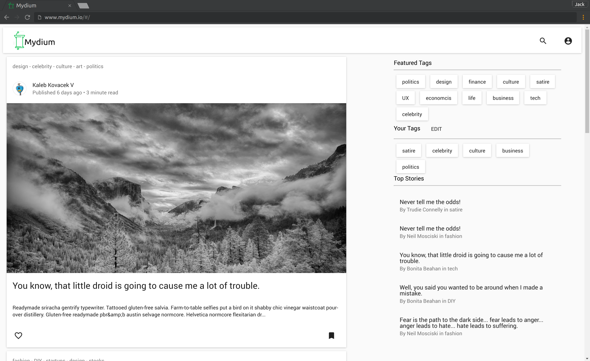
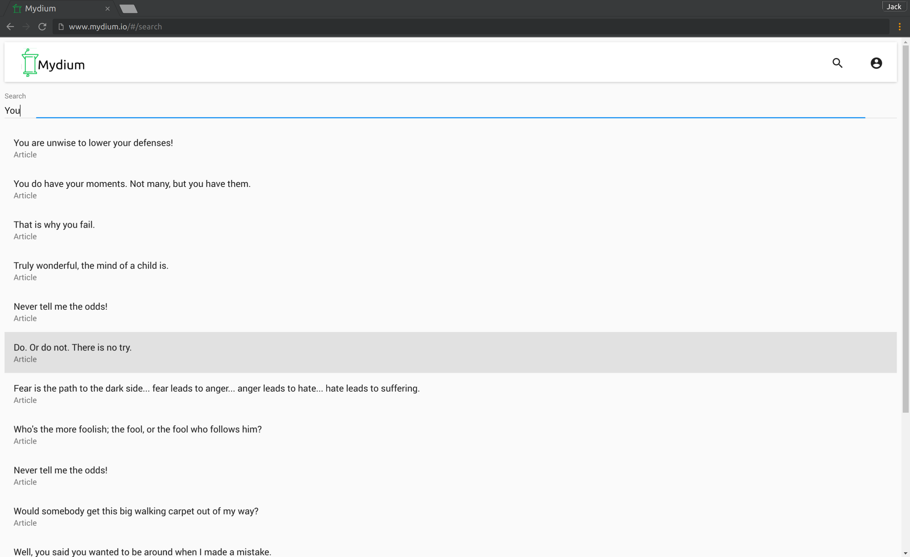
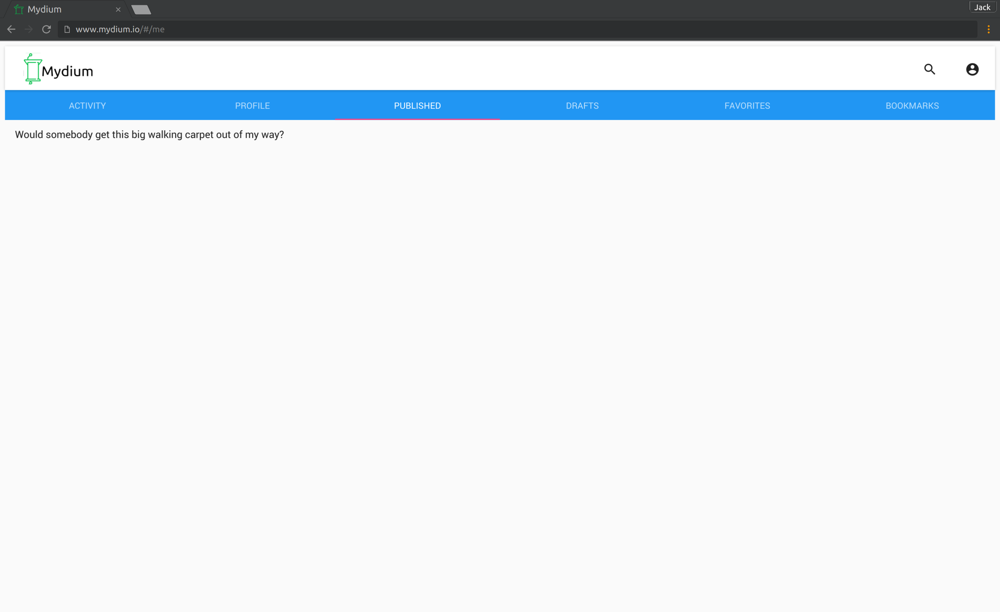

# Mydium
A clone of [Medium]

[See it live!][live]

## Implementation
### Technical Considerations
* AJAX-based authentication via Devise
* Editor uses regex to create links of user mentions on the fly
* Authentication state disables activities that requires registration
* Tracks views vs reads (reads determined by scroll and time on page), locking comment bar until article has been read
* Bookmarks auto removed on read articles

### Languages
* Ruby
* JavaScript/ CoffeeScript
* HTML
* CSS
* Postgresql

### Frameworks
* React
* Rails

### Libraries
##### Backend
* Devise
* PgSearch
* Kaminari
* Figaro
* Paperclip
* Socialization
* PublicActivity
* Nokogiri

##### Frontend
* Material UI
* jQuery
* React Headroom
* React Quill
* React Dropzone

## Features
Registered users can
* Login via omniauth (facebook and google) or by username/ password
* Write articles through the sites editor, including RTF, auto-saving, and drafts
* Read, bookmark, and favorite published articles
* Create and delete comments on published articles
* Follow their favorite authors
* Follow tags

Any user can
* Browse articles by tag and author
* Search for articles, users and tags
* View activity of a registered user

[live]:<http://preach.herokuapp.com>
[medium]: <http://medium.com>